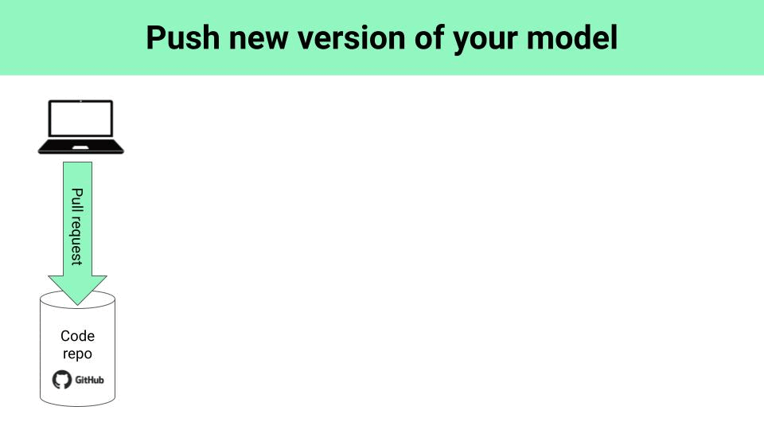

        

    <h1>How to test LLM apps in the real-world</h1>
    <h2>with Giskard and MLOps best-practices</h2>
    

#### Table of contents
* [The problem](#the-problem)
* [Solution](#solution)
* [Run the whole thing in 5 minutes](#run-the-whole-thing-in-5-minutes)
* [Wanna learn more real-time ML?](#wanna-learn-more-real-time-ml)

## The problem

## Solution

## Run the whole thing in 5 minutes

## Wanna learn more real-time ML?

